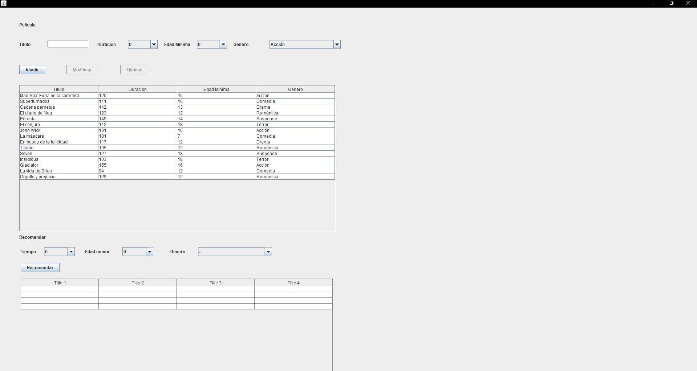
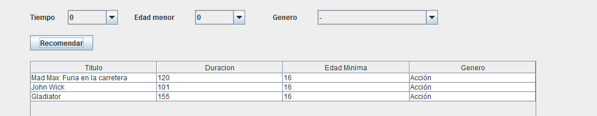

# VideoClubManager

Aplicación de escritorio desarrollada en **Java** para la gestión de películas de un videoclub.

El proyecto utiliza **Java Swing** para la interfaz gráfica y **JDBC** para la conexión con una base de datos **MySQL**.

La aplicación permite consultar, añadir, modificar y eliminar películas, así como realizar recomendaciones utilizando diferentes criterios.

## Características

* Visualización de películas almacenadas en la base de datos.
* Añadir nuevas películas.
* Modificar películas existentes.
* Eliminar películas.
* Gestión y selección de géneros.
* Recomendación de películas según diferentes criterios.
* Filtrado por duración.
* Filtrado por edad mínima.
* Filtrado por género.
* Persistencia de datos mediante MySQL.
* Interfaz gráfica desarrollada con Java Swing.

## Tecnologías utilizadas

* **Java**
* **Java Swing**
* **JDBC**
* **MySQL**
* **NetBeans**
* **Git / GitHub**

## Estructura del proyecto

```text
VideoClubManager/
│
├── src/
│   └── Clases/
│       ├── DBAccess.java
│       ├── Genero.java
│       ├── Pelicula.java
│       └── Pantalla.java
│
├── database/
│   └── videoclub.sql
│
├── docs/
│   ├── pantalla-principal.png
│   └── recomendaciones.png
│
├── README.md
├── .gitignore
└── ...
```

### DBAccess.java

Gestiona la conexión entre la aplicación y la base de datos mediante JDBC.

### Genero.java

Contiene las operaciones relacionadas con los géneros, como consultar los géneros disponibles y obtener el identificador correspondiente.

### Pelicula.java

Contiene las operaciones relacionadas con las películas:

* Consultar películas.
* Añadir películas.
* Modificar películas.
* Eliminar películas.
* Recomendar películas.

### Pantalla.java

Contiene la interfaz gráfica de la aplicación y permite al usuario interactuar con las diferentes funcionalidades.

## Base de datos

El proyecto utiliza **MySQL**.

Se proporciona un archivo SQL de ejemplo que permite crear y preparar automáticamente la base de datos necesaria para ejecutar la aplicación.

El archivo se encuentra en:

```text
database/videoclub.sql
```

El script SQL realiza las siguientes operaciones:

1. Elimina la base de datos `videoclub` si ya existe.
2. Crea la base de datos `videoclub`.
3. Crea la tabla `genero`.
4. Crea la tabla `pelicula`.
5. Establece la relación entre películas y géneros mediante una clave foránea.
6. Inserta varios géneros de ejemplo.
7. Inserta varias películas de ejemplo.

De esta forma, no es necesario crear manualmente las tablas ni introducir los datos iniciales.

### Importar la base de datos

Para preparar la base de datos:

1. Iniciar MySQL.
2. Abrir phpMyAdmin o cualquier otra herramienta de gestión de bases de datos.
3. Seleccionar la opción de importar.
4. Seleccionar el archivo:

```text
database/videoclub.sql
```

5. Ejecutar la importación.

El script creará automáticamente la base de datos `videoclub` junto con sus tablas y datos de ejemplo.

> **Importante:** el script contiene `DROP DATABASE IF EXISTS videoclub`, por lo que si ya existe una base de datos llamada `videoclub`, será eliminada y creada de nuevo al ejecutar el archivo.

La base de datos incluida contiene únicamente datos de ejemplo y no contiene información privada.

## Configuración de la conexión

La aplicación utiliza JDBC para conectarse a MySQL.

En `DBAccess.java` se deben configurar los datos de acceso a la base de datos:

```java
this.conexion = DriverManager.getConnection(cadenaConexion, "DB_User", "DB_Password");
```

`DB_USER` y `DB_PASSWORD` son valores de ejemplo y deben sustituirse por el usuario y contraseña correspondientes a la instalación local de cada usuario.

Por ejemplo:

```java
this.conexion = DriverManager.getConnection(cadenaConexion, "Tu_Usuario", "Tu_Contraseña");
```

Cada instalación de MySQL puede utilizar unas credenciales diferentes.

## Instalación

### 1. Clonar el repositorio

```bash
git clone https://github.com/TU_USUARIO/VideoClubManager.git
```

### 2. Abrir el proyecto

Abrir el proyecto utilizando **NetBeans**.

### 3. Preparar la base de datos

Importar el archivo:

```text
database/videoclub.sql
```

en MySQL.

El script se encargará de crear la base de datos, las tablas y los datos de ejemplo.

### 4. Configurar las credenciales

Modificar `DBAccess.java`:

```java
this.conexion = DriverManager.getConnection(cadenaConexion, "DB_User", "DB_Password");
```

utilizando las credenciales de la instalación local.

### 5. Comprobar el driver JDBC

El proyecto necesita el **driver JDBC de MySQL** para poder establecer la conexión con la base de datos.

### 6. Ejecutar la aplicación

Una vez configurada la base de datos y la conexión, ejecutar:

```text
Pantalla.java
```

desde NetBeans.

## Sistema de recomendaciones

La aplicación incluye un sistema de recomendación que permite buscar películas utilizando diferentes criterios:

* Duración.
* Edad mínima.
* Género.

Los criterios pueden combinarse para obtener películas que coincidan con las características seleccionadas.

## Interfaz

La aplicación dispone de una interfaz gráfica que permite:

* Visualizar las películas existentes.
* Seleccionar una película de la tabla.
* Modificar sus datos.
* Eliminarla.
* Añadir nuevas películas.
* Seleccionar diferentes géneros.
* Realizar recomendaciones mediante filtros.

## Capturas de pantalla

### Pantalla principal



### Sistema de recomendaciones



Las imágenes utilizadas en esta sección se encuentran en la carpeta:

```text
docs/
├── pantalla-principal.png
└── recomendaciones.png
```

## Objetivo del proyecto

Este proyecto ha sido desarrollado como práctica para aplicar diferentes conceptos de programación y desarrollo de aplicaciones:

* Programación orientada a objetos en Java.
* Desarrollo de interfaces gráficas con Swing.
* Conexión con bases de datos mediante JDBC.
* Consultas SQL.
* Operaciones CRUD.
* Manejo de excepciones.
* Gestión de datos desde una aplicación de escritorio.
* Integración entre Java y MySQL.

## Posibles mejoras

Algunas mejoras que podrían incorporarse en futuras versiones:

* Utilizar `PreparedStatement` para las consultas SQL.
* Separar la configuración de la base de datos del código fuente.
* Mejorar la validación de los datos introducidos.
* Añadir búsqueda por título.
* Mejorar el diseño de la interfaz gráfica.
* Añadir más información sobre las películas.
* Ampliar el sistema de recomendaciones.
* Implementar diferentes usuarios y permisos.
* Mejorar la gestión de errores y mensajes al usuario.

## Autor

**Yasin El Kasmi Moumen**

Proyecto desarrollado como parte de mi aprendizaje y portfolio de programación en Java.

